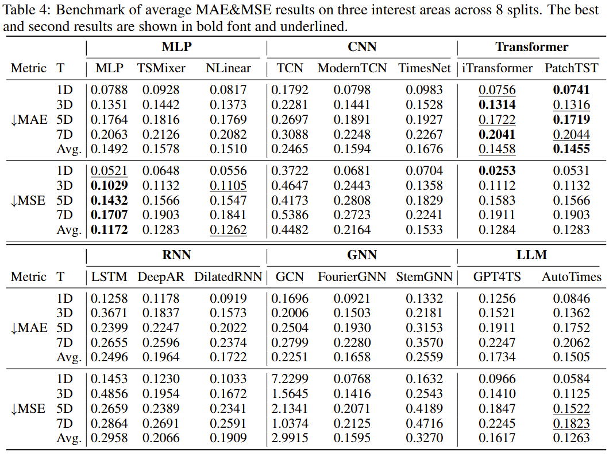
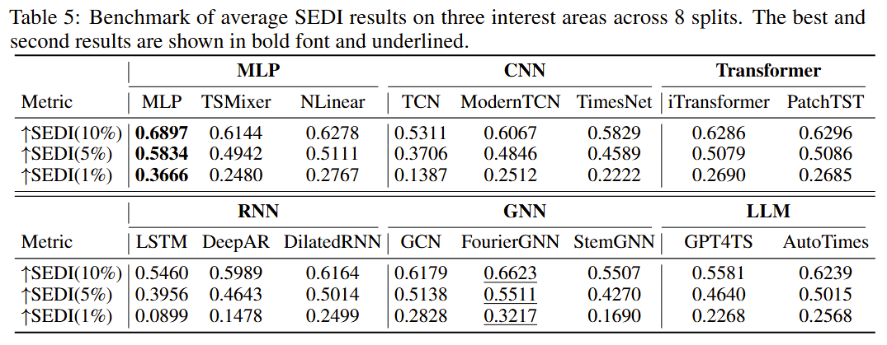

<!-- >📋  A template README.md for code accompanying a Machine Learning paper -->

# SF$^2$Bench: Evaluating Data-Driven Models for Compound Flood Forecasting in South Florida

This repository is the official implementation of [SF$^2$Bench](https://arxiv.org/abs/Placeholder). A benchmark paper of compound flood in the South Florida area. In this paper, we consider seveal key factors for compound flood forecasting, including sea level, rainfall, groundwater and human control/management activities.

<!-- >📋  Optional: include a graphic explaining your approach/main result, bibtex entry, link to demos, blog posts and tutorials -->

## Dataset
Please download the dataset from [ https://doi.org/10.7910/DVN/TU5UXE]( https://doi.org/10.7910/DVN/TU5UXE) and Unzip to dataset folder. The detail information of each file is provided in [Dataset.md](./dataset/Dataset.md)


## Requirements

To install requirements:

```setup
pip install -r requirements.txt
```


## Training

To train the model(s) in the paper, run main.py(load the whole dataset) or main_three_parts.py(load three interest parts). We provide the explanations of each argument. We provide the detailed hyperparameters in run.sh.
```
python main.py --dataset_path [PATH] --cache_dir [cache_PATH] --dataset [split]  --length_input [Lookback]  --length_output [Prediction] \
 --method [model-name] --lr [learning_rate] --weight_decay [Regularization] --epoches [train-epoch] --bachsize [B] --store [Store-model-dict] \
 --device [device] --seed [seed]
```
- **dataset_path**: the dir path of dataset
- **cache_dir**: the dir for save the model state dict
- **length_input**: the length of lookback window
- **length_output**: the length of prediction
- **method**: which architecture, “mlp,tcn,gcn,lstm” for the whole dataset, "mlp,tcn,gcn,lstm,NLinear,TSMixer,GPT4TS,AutoTimes,DeepAR,DilatedRNN,stemGNN,FourierGNN,ModernTCN,Timesnet,PatchTST,iTransformer" for the three parts dataset
- **lr**: learning rate 
- **weight_decay**: regularization weight
- **epoches**: training epoches
- **bachsize**: batch size
- **store**: store the model state dict or not 
- **device**: cpu or cuda
- **seed**: random seeds

<!-- >📋  Describe how to train the models, with example commands on how to train the models in your paper, including the full training procedure and appropriate hyperparameters. -->

## Evaluation

To evaluate the model, the eval.py can be used. Notably, in training main.py/main_three_parts.py, the evaluation results are also available. We provide some pretrain state dict for reproduce our results. The pretrain model state dicts are available on [PlaceHolder](https://)
```eval
python eval.py --dataset_path [PATH] --cache_dir [cache_PATH] --dataset [split]  --length_input [Lookback]  --length_output [Prediction] \
 --bachsize [B] --method [model-name] --device [device] --seed [seed]
```

<!-- >📋  Describe how to evaluate the trained models on benchmarks reported in the paper, give commands that produce the results (section below). -->

## Pre-trained Models
We provide the pretrain model to reporduce the results reported in our paper. Please refer to [google drive](http://placeholder).

<!-- >📋  Give a link to where/how the pretrained models can be downloaded and how they were trained (if applicable).  Alternatively you can have an additional column in your results table with a link to the models. -->

## Results

The detailed results are provided in our paper. The part benchmark results on three interest parts:





<!-- >📋  Include a table of results from your paper, and link back to the leaderboard for clarity and context. If your main result is a figure, include that figure and link to the command or notebook to reproduce it.  -->


<!-- ## Contributing -->

<!-- >📋  Pick a licence and describe how to contribute to your code repository.  -->


## Acknowledgement

Thanks for the help of the South Florida Water Management District(SFWMD) in collecting the raw dataset. Thanks for the support and help of coauthors. This repo borrowed some code from third-party repo and library. Thanks for the contributors. Here is the detailed link of these repos.

- NeuralForecast: [https://github.com/Nixtla/neuralforecast](https://github.com/Nixtla/neuralforecast)
- Time-Series-Library: [https://github.com/thuml/Time-Series-Library](https://github.com/thuml/Time-Series-Library)
- TCN: [https://github.com/locuslab/TCN/tree/master](https://github.com/locuslab/TCN/tree/master)
- ModernTCN: [https://github.com/luodhhh/ModernTCN](https://github.com/luodhhh/ModernTCN)
- FourierGNN: [https://github.com/aikunyi/FourierGNN](https://github.com/aikunyi/FourierGNN)
- StemGNN: [https://github.com/microsoft/StemGNN](https://github.com/microsoft/StemGNN)
- One Fits All: [https://github.com/DAMO-DI-ML/NeurIPS2023-One-Fits-All](https://github.com/DAMO-DI-ML/NeurIPS2023-One-Fits-All)
- AutoTimes: [https://github.com/thuml/AutoTimes/tree/main](https://github.com/thuml/AutoTimes/tree/main)
- Neural-Flood-Forecasting: [https://github.com/nkirschi/neural-flood-forecasting](https://github.com/nkirschi/neural-flood-forecasting)


## Citation
If this repo is useful for you, please consider citing our paper:
```
PlaceHolder
```
